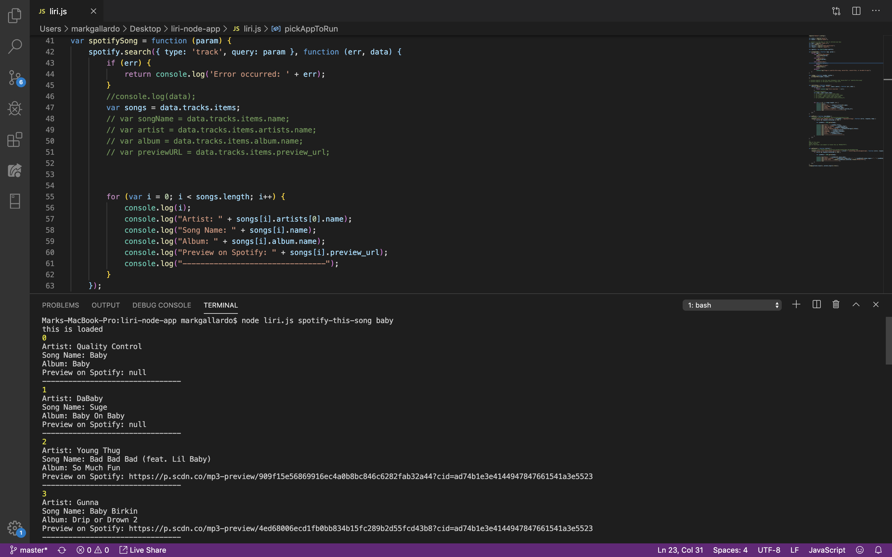
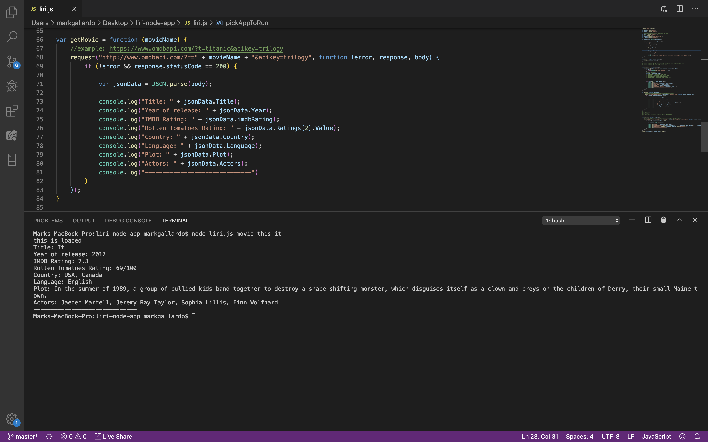
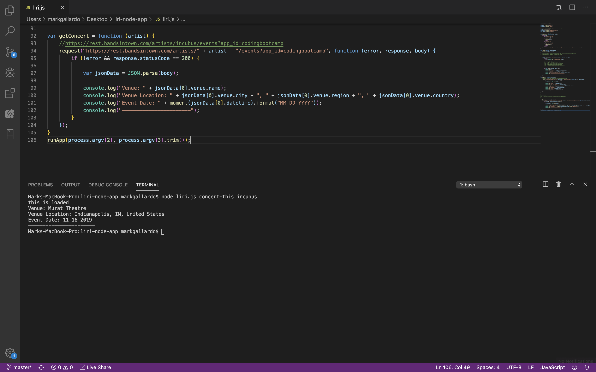
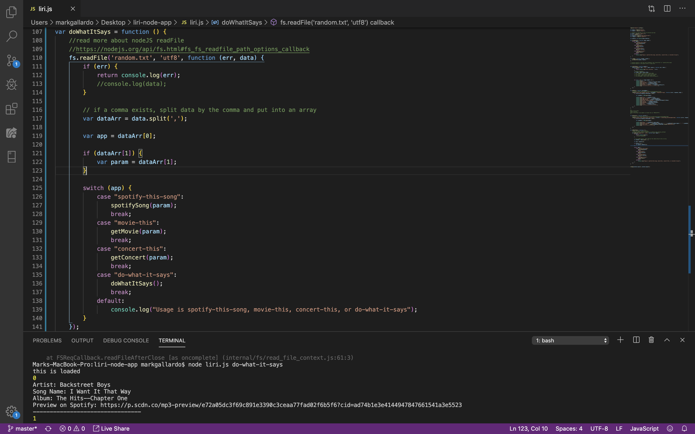

# LIRI App
## Node console app to access APIs
LIRI is like iPhone's SIRI. However, while SIRI is a _Speech Interpretation and Recognition Interface_, LIRI is a _Language Interpretation and Recognition Interface_. LIRI is a command line Node.JS app that takes in parameters and gives you back data from the APIs of [Spotify](https://developer.spotify.com/documentation/web-api/), [OMDb](https://www.omdbapi.com/), or [Bands In Town](https://artists.bandsintown.com/support/bandsintown-api).

## Set Up and Installation
In order for this app to work, you will need to use your own API key from [Spotify](https://developer.spotify.com). Once you have acquired our keys, copy and paste them into the proper locations in the '.env' file in this app.

```
# Spotify API keys

SPOTIFY_ID=your-spotify-id
SPOTIFY_SECRET=your-spotify-secret
```
### Other requirements

These must be installed to use LIRI.

- [Node.js](https://nodejs.org/en/)
- [npm](https://www.npmjs.com/get-npm)
- [dotenv npm package](https://www.npmjs.com/package/dotenv)

## HOW TO USE LIRI:
### DEMO: spotifySong function
The command line is: node liri.js spotify-this-song _songName_.
In our example below, we used the search query '_baby_'. The switch case statement that was created
inside of the pickAppToRun function will determine which function to run based on the search query 
we pass through the terminal. The spotifySong function, when called, will search through Spotify's database for the 
search query we pass through the terminal at process.argv[3]. A FOR LOOP was create so that it will print the top 20 
results in the terminal. 

### DEMO: getMovie function
The command line is: node liri.js movie-this _movieTitle_.
The OMDB Api was used in this function. An AJAX request was created to grab information about the movie title from the OMDB database. The response from the request will print the results in the terminal.

### DEMO: getConcert function
The command line is: node liri.js concert-this _artist or band name_.
The Bands In Town API was used in this function. An AJAX request was created to grab information about the the artist or band name from the Bands in Town database. The response from the request will print the results in the terminal.
In our example, we passed in a command to search events for the band Incubus. As you can see from the terminal, the information about the venue name, location and event date was printed. Moment.js was used to format the data in this format: MM/DD/YYYY.

### DEMO: doWhatItSays function
This function is utilizes the node.JS readFile method to read whatever is inside of  the random.txt file. 
Inside of the random.txt file, we have "spotify-this-song,"I want it That Way". We pass a switch/case statement to help the function determine which function to run. In our example, the spotifySong function will run and return results with the keyword "I want it That Way"."



